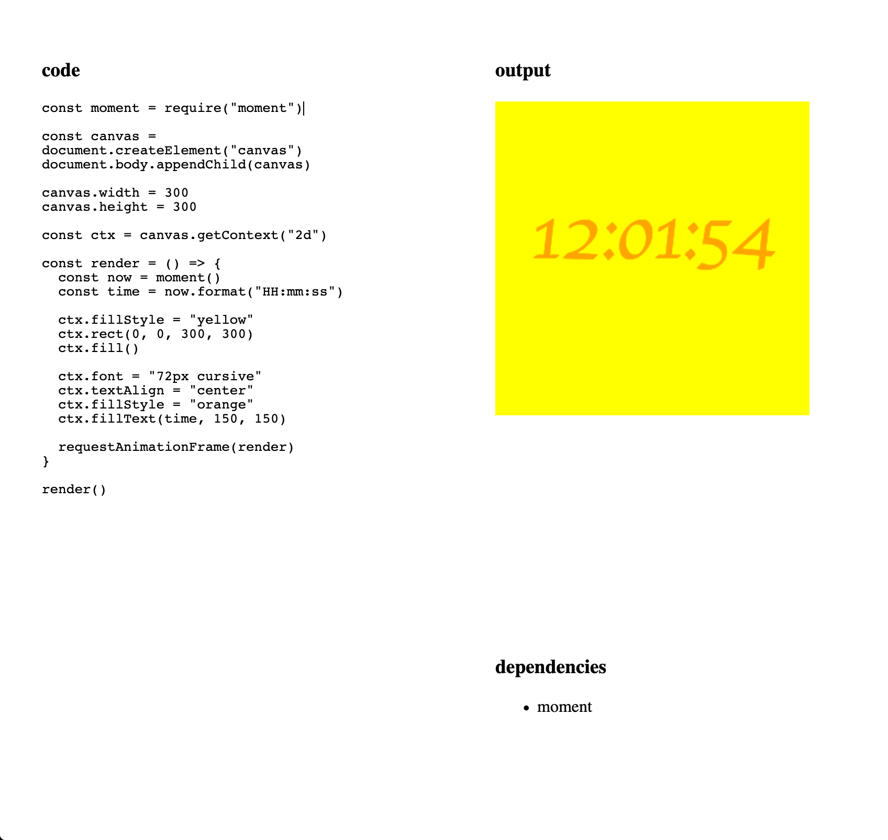

# wzrd

proof of concept using the [wzrd.in](https://github.com/browserify/wzrd.in) API client side to fetch individual npm modules and compose them into a single bundle which can be executed. allows building interactive apps without any server involved.

most of this repo is just demo UI, see the `wzrd` function in `client/index.js` and the module caching in `service-worker.js` for how it works.

demo running here: https://wzrd-ecru.now.sh/

